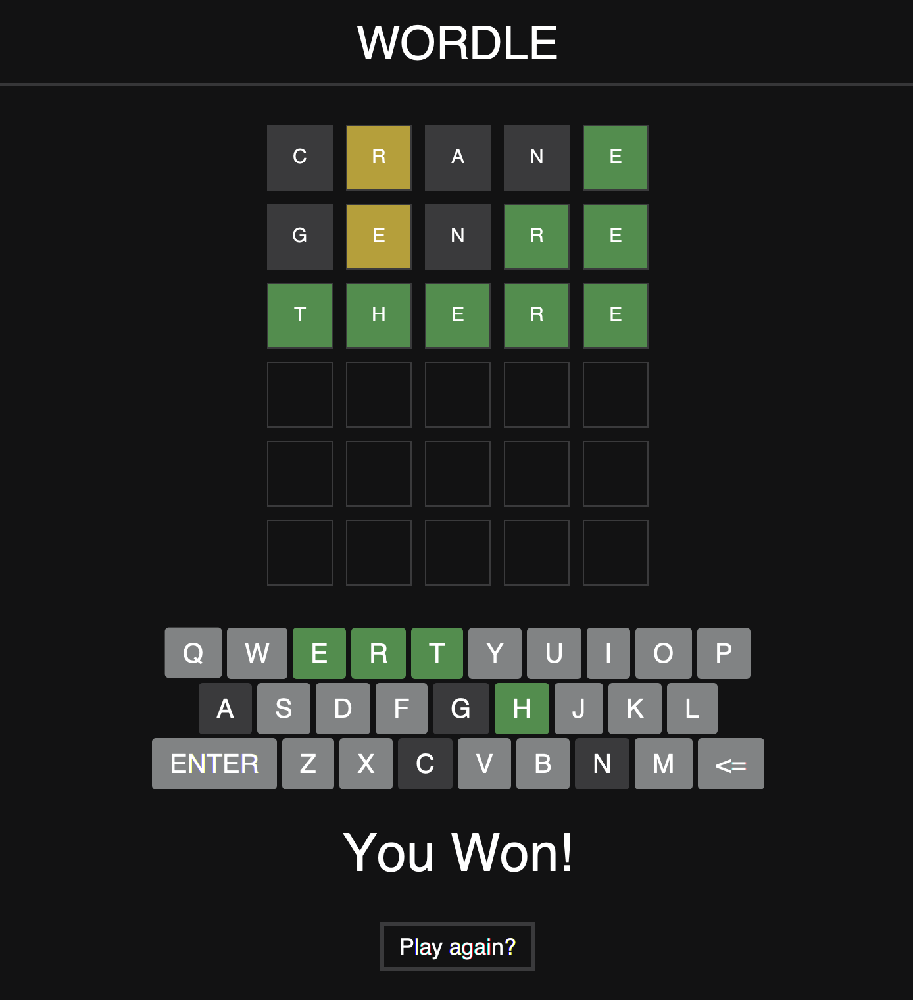

# Wordle
Author: Max Morhardt

A Recreation of the game Wordle in Java. This program uses JavaFX for the UI. This version of the game does not follow the once per day rule, rather picks a random word from the original version's word list.

  

JRE with JavaFX:
- https://bell-sw.com/pages/downloads/ (JRE 17 Full)
